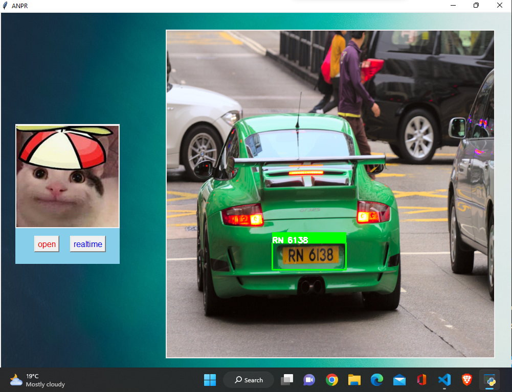
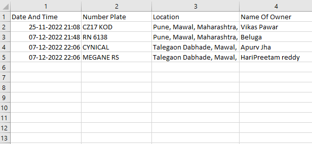

[](https://github.com/WongKinYiu/yolov7/blob/main/LICENSE.md)

# ANPR using YOLOv7

### The goal of our project is to identify a vehicle of interest based on its number plate and mantain record of it's location along with owner's detail. This system can be implemented in public safety domain with law-enforcemnet purposes. Moreover ANPR can be used in advance parking system , tracking vechile speed and identifying  model of vehicle, plus the system can be consider alternative for fastag (which requires some protocols) like speed limit

ANPR automatically reads vehicle registration marks for comparison against database records. The police and government agencies use ANPR as a tactical option to disrupt, prevent and detect criminal activity. ANPR is also used by commercial companies, for example, garages, shopping centres and car parks.

## Inference

On video:
``` shell
python detection.py # change video path in main function 
```
### Result

On image(GUI):
``` shell
python app.py
```

<div align="center">
    <a href="./">
        
    </a>
</div>

Database in csv file:

<div align="center">
    <a href="./">
        
    </a>
</div>
 
 Note : Database created above is just for demonstration purpose and has no relevance with real world
 

## Install requirements 

``` shell
pip install -r  requirements.txt
```


## Implementation Roadmap For esayocr (credit Jaided AI)

- Handwritten support
- Restructure code to support swappable detection and recognition algorithms
The api should be as easy as
``` python
reader = easyocr.Reader(['en'], detection='DB', recognition = 'Transformer')
```
The idea is to be able to plug-in any state-of-the-art model into EasyOCR. There are a lot of geniuses trying to make better detection/recognition models, but we are not trying to be geniuses here. We just want to make their works quickly accessible to the public ... for free. (well, we believe most geniuses want their work to create a positive impact as fast/big as possible) The pipeline should be something like the below diagram. Grey slots are placeholders for changeable light blue modules.


## References 
1) Jaided AI  : https://github.com/JaidedAI/EasyOCR
2) WongKinYiu : https://github.com/WongKinYiu/yolov7
