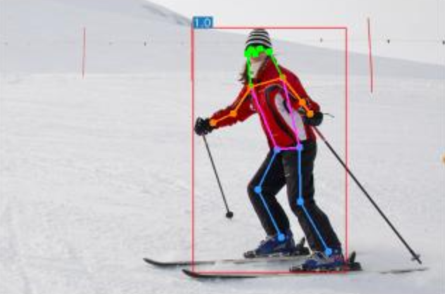
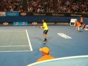

# ANPR using YOLOv7

### The goal of our project is to identify a vehicle of interest based on its number plate and mantain record of it's location along with owner's detail. This system can be implemented in public safety domain with law-enforcemnet purposes. Moreover ANPR can be used in advance parking system , tracking vechile speed and identifying  model of vehicle, plus the system can be consider alternative for fastag (which requires some protocols) like speed limit

ANPR automatically reads vehicle registration marks for comparison against database records. The police and government agencies use ANPR as a tactical option to disrupt, prevent and detect criminal activity. ANPR is also used by commercial companies, for example, garages, shopping centres and car parks.

## Performance 

## Install requirements 

``` shell
pip install -r  requirements.txt
```


## Training

Data preparation

``` shell
bash scripts/get_coco.sh
```

* Download MS COCO dataset images ([train](http://images.cocodataset.org/zips/train2017.zip), [val](http://images.cocodataset.org/zips/val2017.zip), [test](http://images.cocodataset.org/zips/test2017.zip)) and [labels](https://github.com/WongKinYiu/yolov7/releases/download/v0.1/coco2017labels-segments.zip). If you have previously used a different version of YOLO, we strongly recommend that you delete `train2017.cache` and `val2017.cache` files, and redownload [labels](https://github.com/WongKinYiu/yolov7/releases/download/v0.1/coco2017labels-segments.zip) 

Single GPU training


Multiple GPU training

``` shell
# train p5 models
python -m torch.distributed.launch --nproc_per_node 4 --master_port 9527 train.py --workers 8 --device 0,1,2,3 --sync-bn --batch-size 128 --data data/coco.yaml --img 640 640 --cfg cfg/training/yolov7.yaml --weights '' --name yolov7 --hyp data/hyp.scratch.p5.yaml

# train p6 models
python -m torch.distributed.launch --nproc_per_node 8 --master_port 9527 train_aux.py --workers 8 --device 0,1,2,3,4,5,6,7 --sync-bn --batch-size 128 --data data/coco.yaml --img 1280 1280 --cfg cfg/training/yolov7-w6.yaml --weights '' --name yolov7-w6 --hyp data/hyp.scratch.p6.yaml
```

## Transfer learning

[`yolov7_training.pt`](https://github.com/WongKinYiu/yolov7/releases/download/v0.1/yolov7_training.pt) [`yolov7x_training.pt`](https://github.com/WongKinYiu/yolov7/releases/download/v0.1/yolov7x_training.pt) [`yolov7-w6_training.pt`](https://github.com/WongKinYiu/yolov7/releases/download/v0.1/yolov7-w6_training.pt) [`yolov7-e6_training.pt`](https://github.com/WongKinYiu/yolov7/releases/download/v0.1/yolov7-e6_training.pt) [`yolov7-d6_training.pt`](https://github.com/WongKinYiu/yolov7/releases/download/v0.1/yolov7-d6_training.pt) [`yolov7-e6e_training.pt`](https://github.com/WongKinYiu/yolov7/releases/download/v0.1/yolov7-e6e_training.pt)

Single GPU finetuning for custom dataset

``` shell
# finetune p5 models
python train.py --workers 8 --device 0 --batch-size 32 --data data/custom.yaml --img 640 640 --cfg cfg/training/yolov7-custom.yaml --weights 'yolov7_training.pt' --name yolov7-custom --hyp data/hyp.scratch.custom.yaml

# finetune p6 models
python train_aux.py --workers 8 --device 0 --batch-size 16 --data data/custom.yaml --img 1280 1280 --cfg cfg/training/yolov7-w6-custom.yaml --weights 'yolov7-w6_training.pt' --name yolov7-w6-custom --hyp data/hyp.scratch.custom.yaml
```

## Re-parameterization

See [reparameterization.ipynb](tools/reparameterization.ipynb)

## Inference

On video:
``` shell
python detect.py --weights yolov7.pt --conf 0.25 --img-size 640 --source yourvideo.mp4
```

On image:
``` shell
python detect.py --weights yolov7.pt --conf 0.25 --img-size 640 --source inference/images/horses.jpg
```

<div align="center">
    <a href="./">
        
    </a>
</div>


## Export

**Pytorch to CoreML (and inference on MacOS/iOS)** <a href="https://colab.research.google.com/github/WongKinYiu/yolov7/blob/main/tools/YOLOv7CoreML.ipynb"></a>

**Pytorch to ONNX with NMS (and inference)** <a href="https://colab.research.google.com/github/WongKinYiu/yolov7/blob/main/tools/YOLOv7onnx.ipynb"></a>
```shell
python export.py --weights yolov7-tiny.pt --grid --end2end --simplify \
        --topk-all 100 --iou-thres 0.65 --conf-thres 0.35 --img-size 640 640 --max-wh 640
```

**Pytorch to TensorRT with NMS (and inference)** <a href="https://colab.research.google.com/github/WongKinYiu/yolov7/blob/main/tools/YOLOv7trt.ipynb"></a>

```shell
wget https://github.com/WongKinYiu/yolov7/releases/download/v0.1/yolov7-tiny.pt
python export.py --weights ./yolov7-tiny.pt --grid --end2end --simplify --topk-all 100 --iou-thres 0.65 --conf-thres 0.35 --img-size 640 640
git clone https://github.com/Linaom1214/tensorrt-python.git
python ./tensorrt-python/export.py -o yolov7-tiny.onnx -e yolov7-tiny-nms.trt -p fp16
```

**Pytorch to TensorRT another way** <a href="https://colab.research.google.com/gist/AlexeyAB/fcb47ae544cf284eb24d8ad8e880d45c/yolov7trtlinaom.ipynb"></a> <details><summary> <b>Expand</b> </summary>


```shell
wget https://github.com/WongKinYiu/yolov7/releases/download/v0.1/yolov7-tiny.pt
python export.py --weights yolov7-tiny.pt --grid --include-nms
git clone https://github.com/Linaom1214/tensorrt-python.git
python ./tensorrt-python/export.py -o yolov7-tiny.onnx -e yolov7-tiny-nms.trt -p fp16

# Or use trtexec to convert ONNX to TensorRT engine
/usr/src/tensorrt/bin/trtexec --onnx=yolov7-tiny.onnx --saveEngine=yolov7-tiny-nms.trt --fp16
```

</details>

Tested with: Python 3.7.13, Pytorch 1.12.0+cu113

## Pose estimation

[`code`](https://github.com/WongKinYiu/yolov7/tree/pose) [`yolov7-w6-pose.pt`](https://github.com/WongKinYiu/yolov7/releases/download/v0.1/yolov7-w6-pose.pt)

See [keypoint.ipynb](https://github.com/WongKinYiu/yolov7/blob/main/tools/keypoint.ipynb).

<div align="center">
    <a href="./">
        
    </a>
</div>


## Instance segmentation

[`code`](https://github.com/WongKinYiu/yolov7/tree/mask) [`yolov7-mask.pt`](https://github.com/WongKinYiu/yolov7/releases/download/v0.1/yolov7-mask.pt)

See [instance.ipynb](https://github.com/WongKinYiu/yolov7/blob/main/tools/instance.ipynb).

<div align="center">
    <a href="./">
        
    </a>
</div>


## Citation

```
@article{wang2022yolov7,
  title={{YOLOv7}: Trainable bag-of-freebies sets new state-of-the-art for real-time object detectors},
  author={Wang, Chien-Yao and Bochkovskiy, Alexey and Liao, Hong-Yuan Mark},
  journal={arXiv preprint arXiv:2207.02696},
  year={2022}
}
```


## Teaser

Yolov7-semantic & YOLOv7-panoptic & YOLOv7-caption

<div align="center">
    <a href="./">
        
    </a>
    <a href="./">
        
    </a>
    <a href="./">
        
    </a>
    <a href="./">
        
    </a>
</div>


